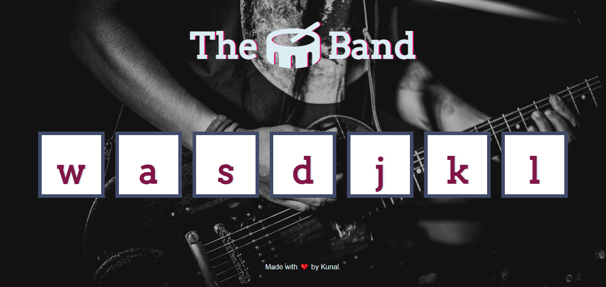

# Drum-kit
# Drum Kit Project

This interactive application allows you to unleash your inner drummer by simulating a virtual drum set. Simply press the corresponding keys on your keyboard, and watch as each drum element responds with realistic sound and animation.

## Table of Contents

- [Demo](#demo)
- [Features](#features)
- [Getting Started](#getting-started)
- [Usage](#usage)
- [Keyboard Mapping](#keyboard-mapping)
- [Technologies Used](#technologies-used)
- [Contributing](#contributing)
- [License](#license)

## Demo

https://kunalbhat55.github.io/Drum-kit/

## Features

- Simulates a virtual drum set with interactive elements.
- Realistic sound and animation for each drum element.
- Easy-to-use keyboard mapping for triggering drum sounds.
- [Add any additional features here]

## Getting Started

To get a local copy up and running, follow these steps:

1. Clone this repository: `git clone https://github.com/your-username/drum-kit.git`
2. Navigate to the project directory: `cd drum-kit`
3. Open `index.html` in a web browser.

## Usage

1. Press the corresponding keys shown on the drum elements to trigger sounds.
2. Enjoy creating your own drum beats!

## Keyboard Mapping

Here is the keyboard mapping for the drum elements:

- `W` - Crash
- `A` - Kick
- `S` - Snare
- `D` - Tom
- `J` - Hi-Hat
- `K` - Ride
- `L` - Floor Tom

Feel free to customize the keyboard mapping in the code if needed.

## Technologies Used

- HTML5
- CSS3
- JavaScript

## Contributing

Contributions are welcome! If you find any issues or want to enhance the project, feel free to open an issue or submit a pull request.

## License

This project is licensed under the [MIT License](LICENSE).

